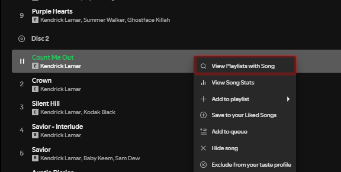
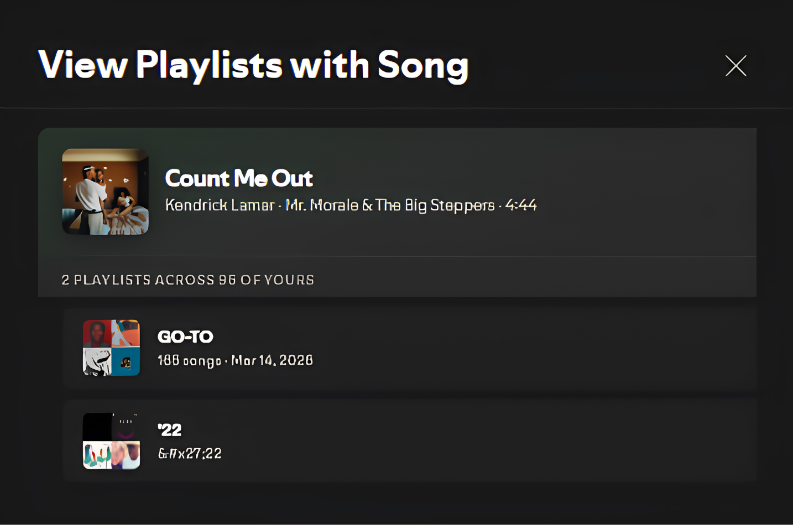

<div align="center">
  
  <h1>Melior</h1>

  <p>
    
    
  </p>

  <p>
    <b>A Spicetify extension that queries and displays user-owned playlists containing a specific track.</b>
  </p>
</div>

<br>

## Overview

Melior integrates natively into the Spotify desktop client, adding a context menu action to identify which of your personal playlists feature the selected song. The extension presents the results in a custom modal engineered to match Spotify's native design language.

## Architecture & Features

- **Playlist Discovery:** Queries all user-owned playlists to find instances of a specific track directly from the context menu.
- **Accurate Metadata Resolution:** Utilizes a custom 5-tier fallback mechanism (GraphQL, Cosmos, and Internal Web Platform endpoints) to guarantee reliable retrieval of album artwork, artist attributes, and track duration.
- **Native User Interface:** The modal utilizes a responsive flexbox architecture to ensure consistent vertical alignment and spacing. It maintains a compact layout with scrollable lists, free of native window scrollbars.
- **Interactive Navigation:** The modal provides direct routing capabilities; users can click the track artwork to access the source album or select a playlist entry to navigate directly to it.
- **Performance Optimization:** Implements local data caching for playlist indices to significantly reduce latency on subsequent queries.

<br>

## Interface Previews

<table align="center" width="100%">
  <tr>
    <td align="center" width="45%">
      <b>Context Menu Integration</b><br><br>
      
    </td>
    <td align="center" width="55%">
      <b>Search Results Modal</b><br><br>
      
    </td>
  </tr>
</table>

<br>

## Installation Guide

### Method 1: Spicetify Marketplace (Recommended)

1. Open the Spotify client and select the Marketplace icon.
2. Navigate to the **Extensions** tab.
3. Search the registry for **Melior**.
4. Select install.

### Method 2: Manual Installation

1. Download the `Melior.js` source file from this repository.
2. Transfer the file to your local Spicetify extensions directory:
   - **Windows:** `%appdata%\spicetify\Extensions`
   - **macOS:** `~/spicetify_data/Extensions`
   - **Linux:** `~/.config/spicetify/Extensions`
3. Execute the following commands in your terminal to apply the configuration:

```bash
spicetify config extensions Melior.js
spicetify apply
```

<br>

## Project Credits

This project builds upon the foundational concept introduced by [spotify-util/ViewPlaylistsWithSong](https://github.com/spotify-util/ViewPlaylistsWithSong). The codebase has undergone a complete architectural rewrite to implement reliable metadata acquisition, establish a responsive flexbox-based UI, and guarantee compatibility with current Spicetify releases.

<br>

<div align="center">
  <b>Author:</b> <a href="https://github.com/pandadoor">Phillip</a><br>
  <i>Developed for the Spicetify ecosystem.</i>
</div>
