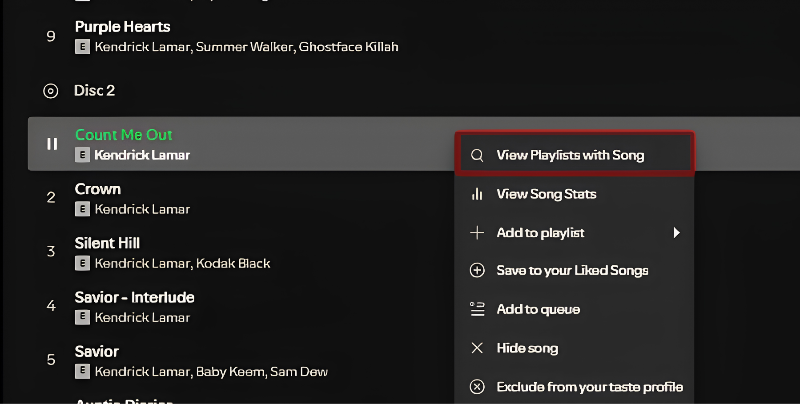

<p align="center">
  
</p>

<h1 align="center">Melior</h1>

<p align="center">
  A premium Spicetify extension for locating every playlist in your library that contains a selected track.
</p>

<p align="center">
  
  
  
  
</p>

<p align="center">
  
</p>

## Overview

Melior extends the Spotify desktop client with a focused workflow for playlist discovery. From any track context menu, it scans your owned playlists, identifies where that song already lives, and presents the matches in a fast, compact workspace designed to feel native inside Spicetify.

The goal is simple: turn "Where have I already saved this track?" into a one-step answer.

## Key Features

| Feature | Details |
| --- | --- |
| Context menu integration | Launch Melior directly from a track in Spotify's context menu. |
| Current-track shortcut | Query the song that is currently playing without leaving playback. |
| Playlist discovery scan | Searches your own playlists and folders to find every matching occurrence of the selected track. |
| Reliable metadata fallback | Uses multiple metadata sources to keep artwork, album, artist, and timing data resilient. |
| Fast repeat lookups | Caches playlist contents and track metadata to reduce repeat latency. |
| Direct routing | Open the source track page or jump straight into any matching playlist. |
| GitHub profile shortcut | Includes a GitHub icon inside the modal that links to the author's GitHub profile. |
| Single-file delivery | Ships as one extension file with embedded styling and no external CSS. |

## Gallery

<table>
  <tr>
    <td width="42%">
      
      <p align="center"><sub>Melior appears directly in the Spotify track context menu.</sub></p>
    </td>
    <td width="58%">
      
      <p align="center"><sub>The results modal shows every matching playlist in your library.</sub></p>
    </td>
  </tr>
</table>

## Installation

### Marketplace

This repository is prepared for Spicetify Marketplace discovery with:

- a root `manifest.json`
- a public repository structure compatible with Marketplace indexing
- the `spicetify-extensions` topic on GitHub

Once Marketplace indexing picks it up, Melior can be installed directly inside Spotify. Manual installation is available immediately.

### Manual Installation

1. Download `Melior.js`.
2. Copy it into your Spicetify Extensions folder.

Platform paths:

| Platform | Extensions folder |
| --- | --- |
| Windows | `%appdata%\\spicetify\\Extensions\\` |
| macOS / Linux | `~/.config/spicetify/Extensions/` |

3. Enable the extension:

```bash
spicetify config extensions Melior.js
spicetify apply
```

If you already use other extensions, append `Melior.js` instead of replacing your existing entries.

## How To Use

1. Right-click a track in Spotify.
2. Choose `Melior: Find in Playlists`.
3. Review every playlist in your library that already contains that track.
4. Click a playlist result to open it directly in Spotify.
5. Use the `Open Track` action to jump to the track page.
6. Use the GitHub icon in the modal header to open the author's GitHub profile.

You can also trigger Melior for the currently playing song from the top menu entry or by using the built-in keyboard shortcut:

```text
Ctrl + Alt + V
```

## Technical Notes

- Built as a single-file Spicetify extension with embedded styles.
- Scans nested rootlist folders and owned playlists through modern Spicetify platform APIs.
- Resolves track metadata through layered fallbacks for stronger resilience against API inconsistencies.
- Keeps playlist and track lookups cached in memory for faster repeat searches.
- Preserves a compact modal footprint while keeping the results list scrollable and usable.

## Inspiration and Attribution

Melior builds on the foundational idea introduced by [spotify-util/ViewPlaylistsWithSong](https://github.com/spotify-util/ViewPlaylistsWithSong).

This version is a substantial modernization focused on current Spicetify compatibility, stronger metadata reliability, improved UI quality, and a more polished user experience.

## Related Projects

- [Symphona](https://github.com/pandadoor/spicetify-symphona) - a routed playlist comparison extension for overlap and exclusive-track analysis.

## Repository Contents

| Path | Purpose |
| --- | --- |
| `Melior.js` | The extension entry point and shipped implementation |
| `manifest.json` | Marketplace metadata |
| `assets/` | Preview graphics and icon assets used in documentation and Marketplace presentation |
